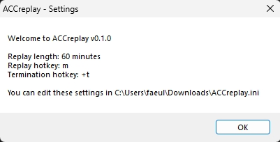
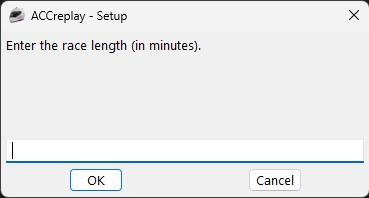
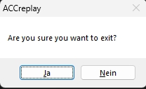

[](https://gitlab.com/markracing/accreplay/-/releases)
[](https://gitlab.com/markracing/accreplay/-/issues)
[](https://gitlab.com/markracing/accreplay/-/merge_requests)
[](https://gitlab.com/markracing/accreplay/-/blob/main/LICENSE)

# ACCreplay

ACCreplay is a lightweight program written with [AutoHotkey](https://www.autohotkey.com/) for automatically saving ACC replays during endurance races where drivers can not or forget to manually save the replay.

ACCreplay will press the hotkey for saving the replay for you. After your defined race length ACCreplay will close itself automatically.

ACCreplay is highly configurable, so you can easily adjust it to your needs.

# Download

Download the latest version here: https://gitlab.com/markracing/accreplay/-/releases

All packages are built and published with Gitlab CI, so that you can see whats inside. All source code used in these packages is publicly available.

# Installation

No installation required, just execute **ACCreplay.exe**.

Continue if Windows Defender warns you about an unknown publisher. This is because the executable isn't signed with a certificate from a reputable publisher.
This prompt will only show once.

If you don't trust the executable, you can also download [AutoHotkey](https://www.autohotkey.com/) and run [`ACCreplay.ahk`](./ACCreplay.ahk) with the native AutoHotkey launcher.

# Usage

After starting ACCreplay you will be greeted with the current settings.
See [Configuration](#configuration) for all available settings and how to change them.



Press `OK` to continue

---

Next enter the race length (**in minutes!**) and press `OK`.



The program will check if your entered race length is valid and longer than your auto replay save interval.

**Important!:** The initial timer for saving your replay will start when you first enter ACC.

---

ACCreplay will be visible in the taskbar. You can also close the program by right-clicking the icon and choose _Exit_


You can also hit the defined termination hotkey (default: shift + x)

A prompt will open to confirm your choice.



Press `Yes` to exit ACCreplay.

Press `No` to abort the termination process.

# Configuration

You can edit the settings by creating a file named `ACCreplay.ini` in the same folder as `ACCreplay.exe`. You can use [ACCreplay.ini](./ACCreplay.ini) as a template for your configuration:

```ini
[Default]
; Auto Replay length settings in minutes, default: 60
; Make sure you set the ingame auto replay max length larger than the ReplayLength
ReplayLength=60

; Hotkey in AutohotKey notation for saving the replay in ACC, default: m
; Make sure the hotkey ingame is the same as this setting!
ReplayHotkey=m

; Hotkey in AutohotKey notation for terminating ACCreplay, default: +x (Shift + x)
TerminationHotkey=+x
```

# Changelog & Releases

This repository keeps a changelog using GitLab's releases functionality.

Releases are based on Semantic Versioning, and use the format of `MAJOR.MINOR.PATCH`. In short, the version will be incremented based on the following:

- `MAJOR`: Incompatible or major changes.
- `MINOR`: Backwards-compatible new features and enhancements.
- `PATCH`: Backwards-compatible bugfixes and package updates.

# Licence

Copyright 2022 Fabian Eulitz

Licensed under the Apache License, Version 2.0 (the "License"); you may not use this file except in compliance with the License. You may obtain a copy of the License at

http://www.apache.org/licenses/LICENSE-2.0

Unless required by applicable law or agreed to in writing, software distributed under the License is distributed on an "AS IS" BASIS, WITHOUT WARRANTIES OR CONDITIONS OF ANY KIND, either express or implied. See the License for the specific language governing permissions and limitations under the License.

# Disclaimer

This project isn’t endorsed by Kunos Simulazioni S.r.l and doesn’t reflect the views or opinions of Kunos Simulazioni S.r.l or anyone officially involved in producing or managing Assetto Corsa Competizione.
